# Bienes Raíces - Node + Express + Tailwind

Proyecto ejemplo con Node.js, Express, Pug, Sequelize (MySQL) y TailwindCSS.

Este README explica cómo levantar el proyecto en desarrollo y cómo ejecutar la demo (servidor). Los comandos están adaptados para PowerShell en Windows.

## Requisitos

- Node.js (>= 18 recomendado)
- npm (v9+ con la versión recomendada de Node)
- MySQL o MariaDB en ejecución

## Archivos importantes

- `index.js` - punto de entrada de la app.
- `config/db.js` - configuración de conexión a la base de datos y variables de entorno.
- `.env` - archivo de variables de entorno (no incluiPdo en el repositorio).
- `seed/seeder.js` - script para importar/eliminar datos de ejemplo.
- `package.json` - scripts y dependencias.

## Variables de entorno

Crea un archivo `.env` en la raíz del proyecto con, como mínimo, estas variables (ajusta valores según tu instalación):

BD_NOMBRE=nombre_de_la_bd
BD_USER=usuario_bd
BD_PASS=clave_bd
BD_HOST=localhost
PORT=3000

Asegúrate de crear la base de datos en MySQL antes de ejecutar el proyecto o usar el seeder.

## Instalación

Abre PowerShell en la carpeta del proyecto y ejecuta:

```powershell
npm install
```

## Scripts útiles

- `npm start` — Ejecuta la app con Node: `node index.js`.
- `npm run server` — Ejecuta la app en modo desarrollo con `nodemon` (reinicia al cambiar archivos).
- `npm run css` — Observa y compila Tailwind CSS a `public/css/app.css`.
- `npm run js` — Ejecuta Webpack en modo watch para compilar los assets JS.
- `npm run dev` — Ejecuta `css` y `js` en paralelo usando `concurrently`.
- `npm run db:importar` — Importa datos de ejemplo en la base de datos (usa `seed/seeder.js -i`).
- `npm run db:eliminar` — Elimina/Resetea las tablas mediante `seed/seeder.js -e`.

Ejemplo para arrancar en desarrollo (PowerShell):

```powershell
# 1) Instalar dependencias (una sola vez)
npm install

# 2) Crear .env con las variables necesarias
# 3) Ejecutar en modo desarrollo (ver CSS y JS en watch y servidor con nodemon)
npm run dev; npm run server

# Alternativa: abrir dos terminales
# Terminal A (CSS): npm run css
# Terminal B (JS + servidor): npm run js; npm run server
```

Nota: Si usas `;` para encadenar, PowerShell ejecuta el siguiente comando independientemente del anterior. Si quieres ejecutar comandos en paralelo abre dos terminales o usa `Start-Process`.

## Levantar solo el servidor (demo)

```powershell
npm run server
```

o

```powershell
npm start
```

## Seeder (datos de ejemplo)

Importar datos:

```powershell
npm run db:importar
```

Eliminar (resetear las tablas):

```powershell
npm run db:eliminar
```

## Problemas comunes

- Error de conexión a la base de datos: revisa las variables en `.env` y que el servicio MySQL esté corriendo.
- Permisos/puerto ocupado: cambia `PORT` en `.env` o libera el puerto.
- Si Tailwind no compila: verifica que `postcss` y `tailwindcss` estén instalados (están en devDependencies).

## Cómo contribuir / próximos pasos

- Añadir instrucciones para despliegue en producción (PM2, Docker, etc.).
- Añadir ejemplo de `.env.example` con variables comentadas.

---


## IMAGENES

## Auth
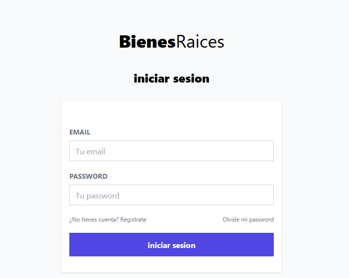
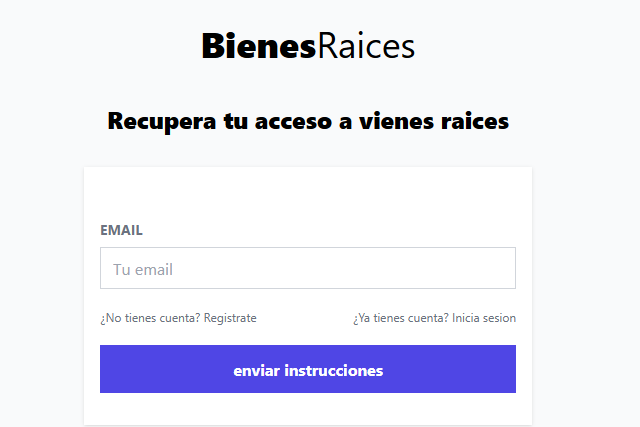
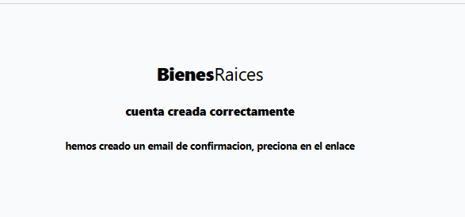


## Publicaciones 
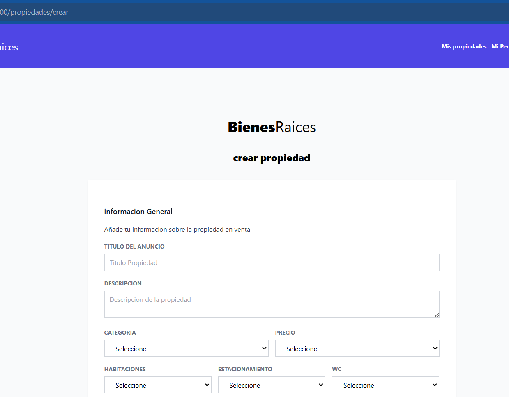
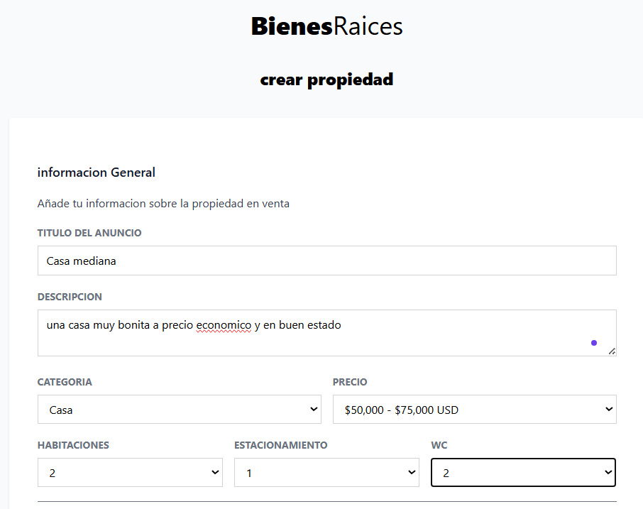
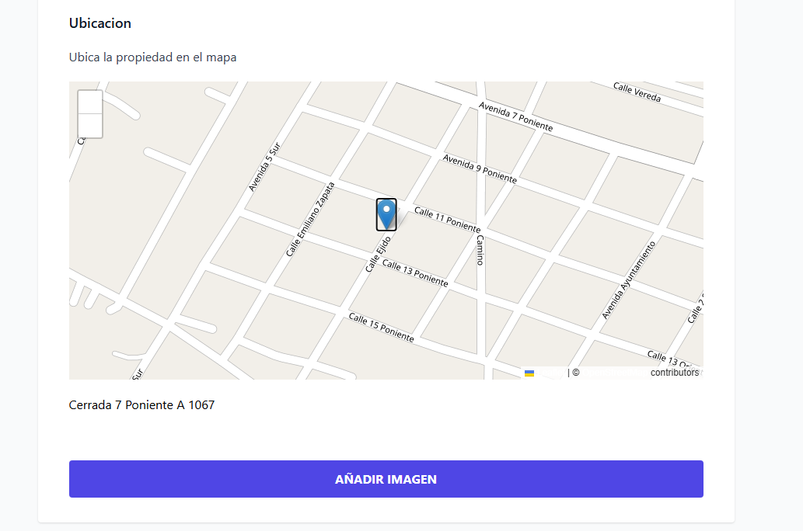
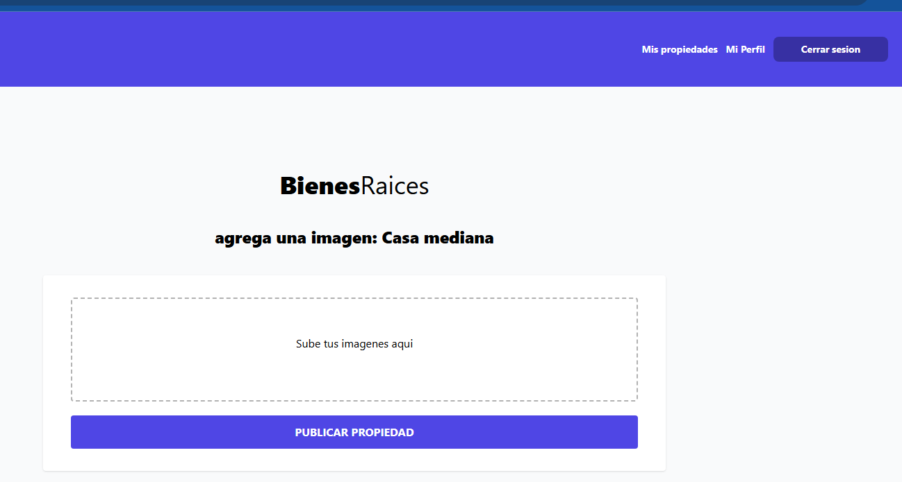

## Publicacion
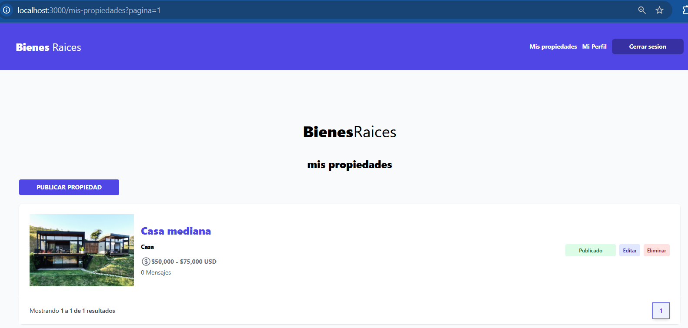


## MAPA
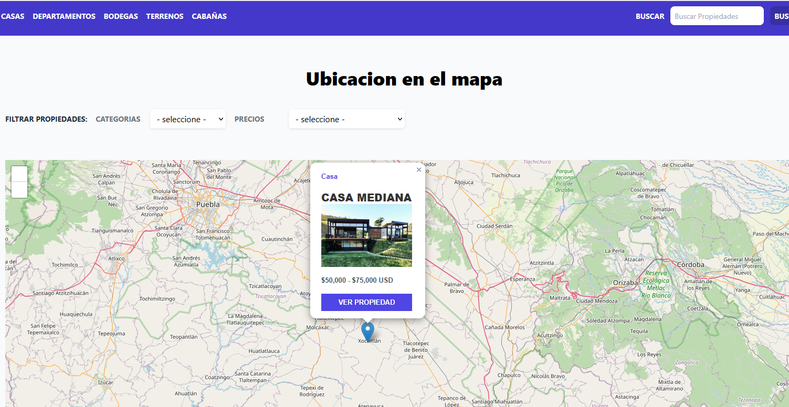

## DETALLES 
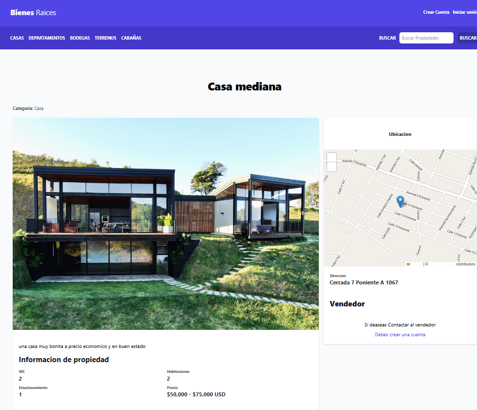
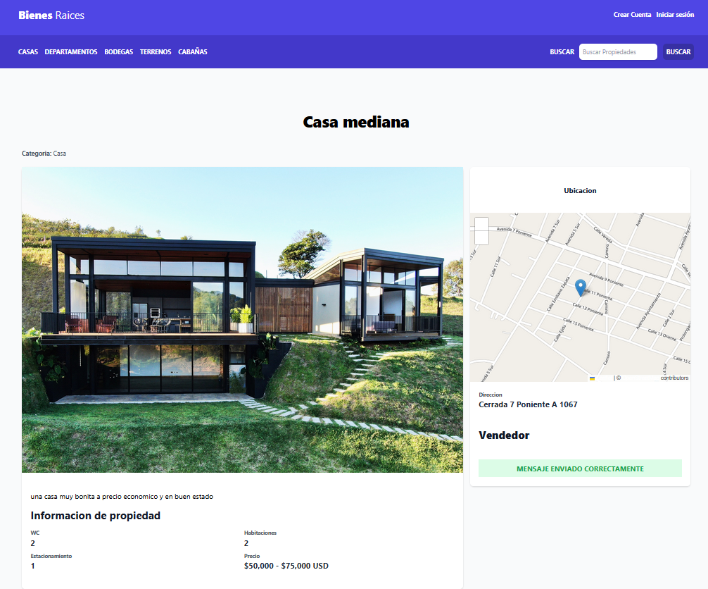